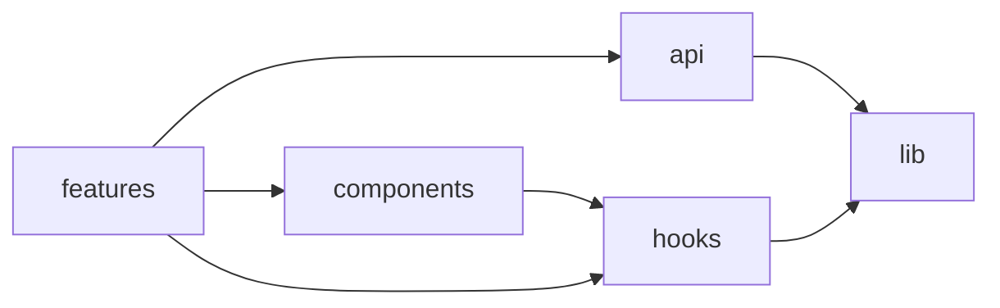

走り読み可能で正確なコードベースのツアーを作ります。網羅的なインデックスではなく、ツアーです。

## 進め方

1. **トップレベル構成。** リポジトリルートで `ls` し、エントリポイントとなるフォルダ（典型: `src/`, `app/`, `packages/`, `apps/`, `services/`）を特定する。
2. **2 階層分。** 各トップレベルフォルダの直下を列挙し、`index.ts` / 代表ファイル / フォルダの README を読んで 1 行責務を導く。
3. **アーキテクチャ様式を判定する。** フロントエンド SPA、Next.js App Router、モノレポ（workspaces?）、マイクロサービス、ライブラリ? まず明示する。
4. **横断関心事を特定する。** 型はどこ? テスト? 設定? ビルド成果物?
5. **依存図を組み立てる。** 重要モジュール 5〜10 個について、何が何に依存するかを示す。Mermaid `flowchart` を使う。

## 出力フォーマット

```markdown
# コードベースマップ

## アーキテクチャ
<1 段落: SPA / モノレポ / RSC など、主要 FW、パッケージマネージャ>

## 構成

```
project/
├── src/
│   ├── components/    # 表示用 UI 部品
│   ├── features/      # 機能スコープのロジック（1 機能 = 1 フォルダ）
│   ├── hooks/         # 共有フック
│   ├── lib/           # FW 非依存ユーティリティ
│   └── api/           # API クライアント + 型
├── tests/             # integration + e2e
└── package.json
```

## モジュール依存



## 知っておくべき規約
- <事項>: <場所>
- ...

## どこから読み始めるか
1. `<エントリポイント>` — アプリケーションブート
2. `<主要 feature フォルダ>` — まず 1 機能を端から端まで読む
3. `<テストセットアップ>` — テスト方針を理解する
```

## ルール

- **Mermaid は明確化に寄与するときだけ使う。** 意味ある矢印が 5 本未満なら図を省き、散文で書く。
- **ファイル全部を列挙しない。** 中身が予測可能なディレクトリで止める。
- **読んで検証する。** あるフォルダを「API クライアント」と呼ぶなら、最低 1 ファイル開いて確認する。
- **不明点は不明と述べる。** 「`src/foo/` の目的を判定できなかった — 3 ファイルで関心事が混在」。捏造より良い。
- マップ全体を 1 画面以内に収める。プロジェクトが巨大なら 1 スライスずつマップし、どのスライスを見たいかユーザーに尋ねる。

## ユーザーが頼みうるバリエーション

- **「auth フローをマップして」** — login → session → 保護ルートを辿る。シーケンス図でレンダー。
- **「データフローをマップして」** — DB → API → クライアント。永続層を下に置いた flowchart。
- **「テストピラミッドをマップして」** — unit / integration / e2e フォルダと件数。

各バリエーションでも同じ流れ: 正確になる程度に読み、最小限にレンダー、正直にラベル付け。
